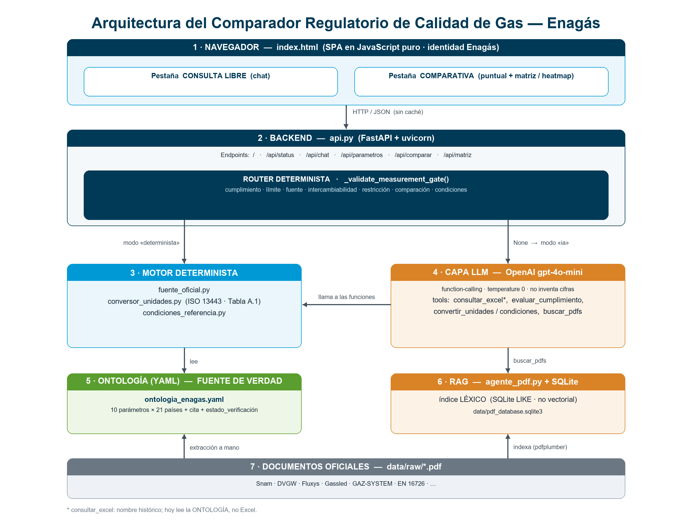
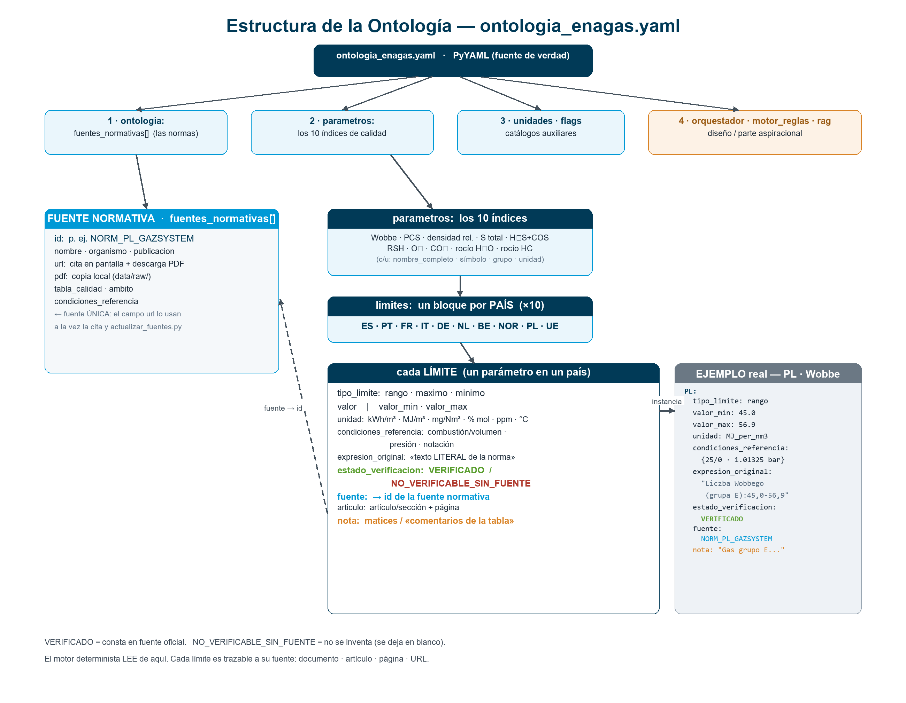

# Manual del Comparador Regulatorio de Calidad de Gas Natural — Enagás

*Documento único de referencia para el equipo. Describe **qué hace** la aplicación, **cómo está construida** (arquitectura) y **cómo se organizan los datos** (ontología). Cotejado con el código y con los datos reales — versión de ontología **3.1.0**, revisión **2026-06**.*

---

## 1. Qué es y qué hace

El Comparador es un **asistente que compara los límites regulatorios de calidad del gas natural** entre **21 jurisdicciones** europeas, para los **10 parámetros** de calidad del alcance. Responde en lenguaje natural (chat) y ofrece una vista de **comparativa** con matriz visual.

Su principio de diseño es **"cero alucinaciones numéricas"**: todas las cifras salen de una base de datos verificada contra los boletines oficiales; el modelo de lenguaje solo redacta, nunca inventa un número.

**Qué se le puede preguntar** (ejemplos reales):

- *"¿Cuál es el límite de O₂ en Alemania?"* → valor + cita de la norma.
- *"¿Cumple 14 kWh/m³ de PCS en Francia?"* → cumple / no cumple, con el rango oficial.
- *"Compara el azufre total entre España y Países Bajos."* → tabla con normalización.
- *"¿Es Italia más restrictiva que España en CO₂?"*
- *"Pasa 55 MJ/m³ de Wobbe de Portugal a condiciones de España."* → conversión ISO 13443.

**Las dos pestañas de la web:**

1. **Consulta libre** — chat en lenguaje natural.
2. **Comparativa** — selección puntual de parámetro/países y una **matriz** (21 países × 10 parámetros) con el estado de comparabilidad frente a España.

---

## 2. Los 10 parámetros de calidad

| # | Parámetro | Qué mide | Unidad base (ES) | Límite en España |
|---|---|---|---|---|
| 1 | **Índice de Wobbe** | Mide la **intercambiabilidad** del gas: el aporte calorífico a través de un quemador a presión dada. Es el criterio clave para saber si dos gases son intercambiables sin reajustar los equipos. | kWh/m³ | 13,403 – 16,058 kWh/m³ |
| 2 | **PCS (poder calorífico superior)** | **Energía** liberada por la combustión completa de 1 m³ de gas (con el agua de los humos condensada). Es lo que se factura. | kWh/m³ | 10,26 – 13,26 kWh/m³ |
| 3 | **Densidad relativa** | Densidad del gas dividida por la del aire (adimensional). Interviene en el Índice de Wobbe. | — | 0,555 – 0,7 |
| 4 | **Azufre total (S)** | **Azufre total** (todos los compuestos de azufre). Límite ambiental y de corrosión. | mg/m³ | ≤ 50 mg/m³ |
| 5 | **H₂S + COS** | Sulfuro de hidrógeno + sulfuro de carbonilo, **expresados como azufre**. Corrosión y toxicidad. | mg/m³ | ≤ 15 mg/m³ |
| 6 | **Mercaptanos (RSH)** | **Mercaptanos** (azufre mercaptánico). Son los odorizantes; se limitan aparte del H₂S. | mg/m³ | ≤ 17 mg/m³ |
| 7 | **O₂ (oxígeno)** | **Oxígeno**. Favorece corrosión y es incompatible con almacenamientos subterráneos. | % mol | ≤ 0,01 % mol |
| 8 | **CO₂** | **Dióxido de carbono**. Rebaja el poder calorífico y es corrosivo con humedad. | % mol | ≤ 2,5 % mol |
| 9 | **Punto de rocío del agua** | **Punto de rocío del agua**: temperatura a la que condensaría el agua del gas. Evita agua líquida en la red. | °C | ≤ 2 °C |
| 10 | **Punto de rocío de hidrocarburos** | **Punto de rocío de hidrocarburos**: temperatura a la que condensarían los hidrocarburos pesados. | °C | ≤ 5 °C |

> La "unidad base (ES)" es la que usa la normativa española; cuando otro país usa otra unidad o condiciones, el sistema **normaliza** antes de comparar (ver §6).

---

## 3. Las 21 jurisdicciones y su norma de referencia

Cada país aporta sus límites desde su **fuente oficial** (boletín, norma técnica del TSO o estándar). España es siempre la **base de referencia** de la comparación.

| País | Cód. | Norma de referencia (fuente primaria) | Cond. comb/vol |
|---|---|---|---|
| España *(base)* | ES | Orden TED/181/2025 | 0/0 |
| Portugal | PT | Regulamento n.º 826/2023 | 25/0 |
| Francia | FR | GRTgaz | 0/0 |
| Italia | IT | Qualità del gas naturale | 15/15 |
| Alemania | DE | DVGW Arbeitsblatt G 260 (2021) | 25/0 |
| Países Bajos | NL | Energieregeling (Países Bajos), art. 3.16 «invoed- en afleverspecifica… | 25/0 |
| Bélgica | BE | Fluxys Belgium | 25/0 |
| Noruega | NOR | Gassco | 25/0 |
| Polonia | PL | Rozporządzenie w sprawie szczegółowych warunków funkcjonowania systemu… | 25/0 |
| Dinamarca | DK | Bekendtgørelse om gaskvalitet (BEK nr 230 af 21/03/2018) | 25/0 |
| Hungría | HU | 19/2009. (I. 30.) Korm. rendelet, 11. számú melléklet «A földgáz minős… | 25/0 |
| Austria | AT | ÖVGW Richtlinie G B210 «Gasbeschaffenheit» (antes G31) | 25/0 |
| Suiza | CH | SVGW/SSIGE Richtlinie G18 «Gasbeschaffenheit» | 25/0 |
| Chequia | CZ | Řád provozovatele přepravní soustavy (Network Code de NET4GAS), Příloh… | 15/15 |
| Grecia | GR | Κώδικας Διαχείρισης ΕΣΦΑ (DESFA Network Code), ΠΑΡΑΡΤΗΜΑ I «Προδιαγραφ… | 25/0 |
| Irlanda | IE | Gas Networks Ireland | 15/15 |
| Rumanía | RO | Regulament de măsurare a gazelor naturale, Anexa nr. 5 «Cerințe minime… | 15/15 |
| Eslovaquia | SK | Technické podmienky de eustream, a.s. (PPS), Príloha č. 1 «Kvalitatívn… | 25/20 |
| Turquía | TR | BOTAŞ Şebeke İşleyiş Düzenlemelerine İlişkin Esaslar (ŞİD), EK-1 «Doğa… | 15/15 |
| Reino Unido | GB | The Gas Safety (Management) Regulations 1996 (GS(M)R), Schedule 3 + NT… | 15/15 |
| UE | UE | EN 16726:2025 | 15/15 |

> **Condiciones comb/vol** = temperatura de combustión / temperatura del volumen de referencia, en °C. Determinan si un PCS/Wobbe o una concentración másica necesita normalización (§6).

---

## 4. Arquitectura híbrida "cero alucinaciones"

El sistema separa a propósito **dos mundos**:

- **Mundo determinista** (código + ontología): la **única** fuente autorizada de cifras, límites, conversiones y comparaciones. Nunca improvisa un número.
- **Mundo conversacional** (LLM): interpreta la pregunta y **redacta** la respuesta, pero tiene prohibido generar cifras — las obtiene llamando a herramientas deterministas.

La regla está implementada como **determinista-primero, LLM-fallback**: las preguntas estructuradas se resuelven con código (sin riesgo de alucinación); solo las abiertas pasan al LLM, obligado a apoyarse en herramientas y documentos oficiales.



**Recorrido de una consulta:** Frontend (`index.html`) → Backend (`api.py`, FastAPI) → **router determinista** (`_validate_measurement_gate`). Si el router reconoce la intención, responde con `modo: "determinista"`. Si no, pasa al **LLM** (OpenAI `gpt-4o-mini`, function-calling, `temperature=0`), que llama a las herramientas deterministas y al **RAG** de PDFs.

---

## 5. La ontología — el corazón del sistema

**Archivo:** `data/ontologia/ontologia_enagas.yaml` — la extracción **verificada verbatim** de los PDF oficiales. El motor lee de aquí; el LLM nunca calcula.

**Estructura de nivel superior:**

| Clave | Contenido |
|---|---|
| `ontologia.fuentes_normativas` | Las normas: `id`, `nombre`, `organismo`, `publicacion`, `url` (cita), `pdf` (copia local), condiciones y notas. |
| `ontologia.jurisdicciones` | Las 21 jurisdicciones: código, nombre, fuente principal, condiciones por defecto. |
| `parametros` | Los **10 parámetros**, cada uno con su bloque `limites:` por país. |

**Cada límite** (por parámetro y país) lleva: `valor` o `valor_min`/`valor_max`, `unidad`, `tipo_limite`, `condiciones_referencia`, `expresion_original` (texto literal de la fuente), la cita (`fuente` + `articulo`), una `nota` explicativa y —lo más importante— el **`estado_verificacion`**.

**Estados de verificación** (la garantía anti-invención):

- `VERIFICADO` — cifra contrastada **verbatim** contra su fuente oficial.
- `NO_VERIFICABLE_SIN_FUENTE` — la norma citada **no fija** esa cifra → **no se inventa**, se marca como hueco honesto.
- `PENDIENTE_EXTRACCION` — la cifra existe pero aún no se ha extraído (queda `null`).

**Ejemplo real** — el bloque del PCS de España tal cual está en la ontología:

```yaml
      ES:
        fuente: ORDEN_TED_181_2025
        articulo: "Tabla 3, apartado 2.5.2.1 (pág. 26)"
        tipo_limite: rango
        valor_min: 10.26
        valor_max: 13.26
        unidad: kWh_per_nm3
        expresion_original: "PCS: Mínimo 10,26 — Máximo 13,26 kWh/m³"
        equivalencia_MJ_per_nm3: { valor_min: 36.94, valor_max: 47.74, nota: "× 3,6 MJ/kWh" }
        condiciones_referencia: { norma_calculo: EN_ISO_6976, temperatura_combustion_C: 0, temperatura_volumen_C: 0, presion_bar: 1.01325, notacion: "@0/0" }
        estado_verificacion: VERIFICADO
```



---

## 6. El motor determinista y la normalización (ISO 13443)

| Módulo | Función |
|---|---|
| `fuente_oficial.py` | Lee la ontología y devuelve el registro con cita completa. Mapea nombre de país ↔ código. |
| `conversor_unidades.py` | Convierte unidades (energía, temperatura, concentración) y aloja la **Tabla A.1 literal de la ISO 13443**. |
| `condiciones_referencia.py` | Mapea cada país a sus condiciones de referencia y delega el factor ISO 13443. |

**Por qué hace falta normalizar:** los países expresan sus límites en unidades y condiciones distintas. Para comparar de forma justa, el PCS/Wobbe se lleva a **kWh/m³ y a las condiciones de España (0/0)** con los factores de la **Tabla A.1**:

| A condiciones de España (0/0) | PCS | Wobbe |
|---|---|---|
| **25/0 → 0/0** (Portugal, Alemania, P. Bajos, Bélgica, Noruega, Polonia, Dinamarca, Hungría, Austria, Suiza, Grecia) | 1,0026 | 1,0026 |
| **15/15 → 0/0** (Italia, UE, Chequia, Irlanda, Rumanía, Turquía, Reino Unido) | 1,0570 | 1,0569 |
| **25/20 → 0/0** (Eslovaquia — par no tabulado, ecuaciones del Anexo B) | ≈1,076 | ≈1,076 |
| **0/0 → 0/0** (España, Francia) | ×1 (identidad) | ×1 |

Además de kWh/m³ y MJ/m³, el conversor admite **kcal/m³** (Turquía y Rumanía). Las concentraciones **másicas** (mg/m³) referidas a un volumen a T ≠ 0 °C (p. ej. Italia a 15 °C) se normalizan con el factor de gas ideal `(273,15+T)/273,15`. El **% mol**, lo **adimensional** y los **puntos de rocío** (°C) **no** dependen de la temperatura del volumen.

---

## 7. El router determinista (7 intenciones)

`api.py → _validate_measurement_gate` reconoce y resuelve **sin LLM**:

1. **Cumplimiento** (valor + unidad → cumple / no cumple).
2. **Límite/valor** (sin valor → muestra los límites).
3. **¿De qué reglamento sale?** (cita la fuente).
4. **Intercambiabilidad** (solape de rangos frente a España).
5. **Más restrictivo / más amplio que España.**
6. **Comparación** España ↔ país.
7. **Conversión a condiciones de España** (ISO 13443).

---

## 8. La capa LLM y el RAG (preguntas abiertas)

- **LLM:** OpenAI `gpt-4o-mini` (configurable), function-calling, `temperature=0`, hasta 5 iteraciones. El `SYSTEM_PROMPT` le **prohíbe inventar cifras** y fija el ámbito. Si OpenAI falla o no hay clave, **cae al motor determinista** (el chat nunca da error 500).
- **RAG:** `agente_pdf.py` indexa los PDF de `data/raw/` (troceados por página) en **SQLite** y hace **búsqueda léxica** (`LIKE`). Es léxico, **no vectorial** (sin embeddings), aunque la ontología describa un diseño con Vector DB.

---

## 9. Estado real de los datos

Cobertura actual: **176 celdas VERIFICADO**, **34 NO_VERIFICABLE_SIN_FUENTE**, 0 pendientes, sobre 210 celdas (10 parámetros × 21 jurisdicciones). Las 210 celdas resuelven por la ruta real de la aplicación.

**✓** = verificado verbatim · **○** = la norma no fija ese parámetro (hueco honesto)

| Parámetro | ES | PT | FR | IT | DE | NL | BE | NOR | PL | DK | HU | AT | CH | CZ | GR | IE | RO | SK | TR | GB | UE |
|---|:-:|:-:|:-:|:-:|:-:|:-:|:-:|:-:|:-:|:-:|:-:|:-:|:-:|:-:|:-:|:-:|:-:|:-:|:-:|:-:|:-:|
| Índice de Wobbe | ✓ | ✓ | ✓ | ✓ | ✓ | ✓ | ✓ | ✓ | ✓ | ✓ | ✓ | ✓ | ✓ | ✓ | ✓ | ✓ | ○ | ✓ | ✓ | ✓ | ✓ |
| PCS | ✓ | ○ | ✓ | ✓ | ○ | ○ | ✓ | ✓ | ✓ | ○ | ✓ | ✓ | ✓ | ✓ | ✓ | ✓ | ✓ | ✓ | ✓ | ✓ | ○ |
| Densidad relativa | ✓ | ✓ | ✓ | ✓ | ✓ | ○ | ○ | ○ | ○ | ✓ | ○ | ✓ | ✓ | ✓ | ✓ | ✓ | ○ | ✓ | ○ | ✓ | ✓ |
| Azufre total | ✓ | ✓ | ✓ | ✓ | ✓ | ✓ | ✓ | ✓ | ✓ | ✓ | ✓ | ✓ | ✓ | ✓ | ✓ | ✓ | ✓ | ✓ | ✓ | ✓ | ✓ |
| H₂S + COS | ✓ | ✓ | ✓ | ✓ | ✓ | ✓ | ✓ | ✓ | ✓ | ✓ | ✓ | ✓ | ✓ | ✓ | ✓ | ✓ | ✓ | ✓ | ✓ | ✓ | ✓ |
| Mercaptanos | ✓ | ○ | ✓ | ✓ | ✓ | ✓ | ○ | ✓ | ✓ | ✓ | ○ | ✓ | ✓ | ✓ | ○ | ○ | ○ | ✓ | ✓ | ○ | ✓ |
| O₂ | ✓ | ○ | ✓ | ✓ | ✓ | ✓ | ○ | ✓ | ✓ | ○ | ✓ | ✓ | ✓ | ✓ | ✓ | ✓ | ✓ | ✓ | ✓ | ✓ | ✓ |
| CO₂ | ✓ | ○ | ✓ | ✓ | ✓ | ✓ | ○ | ✓ | ✓ | ○ | ○ | ✓ | ✓ | ✓ | ✓ | ✓ | ✓ | ✓ | ✓ | ✓ | ✓ |
| Punto de rocío del agua | ✓ | ○ | ✓ | ✓ | ✓ | ✓ | ○ | ✓ | ✓ | ✓ | ✓ | ✓ | ✓ | ✓ | ✓ | ○ | ✓ | ✓ | ✓ | ✓ | ✓ |
| Punto de rocío de hidrocarburos | ✓ | ○ | ✓ | ✓ | ✓ | ○ | ○ | ✓ | ○ | ✓ | ✓ | ✓ | ✓ | ✓ | ✓ | ✓ | ✓ | ✓ | ✓ | ✓ | ✓ |

Los huecos **no** son errores: son parámetros que **la norma de ese país no fija numéricamente** (y por política no se inventan). Detalle:

| País | Parámetros no fijados por su norma |
|---|---|
| Portugal | PCS, Mercaptanos, O₂, CO₂, Punto de rocío del agua, Punto de rocío de hidrocarburos |
| Alemania | PCS |
| Países Bajos | PCS, Densidad relativa, Punto de rocío de hidrocarburos |
| Bélgica | Densidad relativa, Mercaptanos, O₂, CO₂, Punto de rocío del agua, Punto de rocío de hidrocarburos |
| Noruega | Densidad relativa |
| Polonia | Densidad relativa, Punto de rocío de hidrocarburos |
| Dinamarca | PCS, O₂, CO₂ |
| Hungría | Densidad relativa, Mercaptanos, CO₂ |
| Grecia | Mercaptanos |
| Irlanda | Mercaptanos, Punto de rocío del agua |
| Rumanía | Índice de Wobbe, Densidad relativa, Mercaptanos |
| Turquía | Densidad relativa |
| Reino Unido | Mercaptanos |
| UE | PCS |

---

## 10. Diseño ideal vs. implementación real (honestidad de ingeniería)

| El diseño / la ontología dice… | La realidad del código es… |
|---|---|
| RAG con **Vector DB + similitud coseno** | **Búsqueda léxica** SQLite `LIKE` (sin vectores) |
| Normalización **"con `pint`"** | `pint` no se importa; conversiones = tablas verificadas a mano |
| Historial de conversación persistente | **En memoria**; se pierde al reiniciar |

---

## 11. Cómo se ejecuta y se mantiene

- **`iniciar_chatbot.bat`** — lanzador del equipo: se auto-actualiza (`git pull --ff-only`), libera el puerto 8000 y arranca `uvicorn`. La web se sirve **sin caché** (siempre la última versión tras un `git pull`).
- **`actualizar_fuentes.py`** — descarga los PDF desde el campo `url` de la ontología (fuente única de la cita y de la descarga).
- **Stack:** Python · FastAPI · uvicorn · OpenAI SDK · PyYAML · pdfplumber · sqlite3. Frontend: HTML + JavaScript vanilla (marked + DOMPurify).

---

## 12. Garantía de calidad (barrida de auditoría)

La última barrida profunda confirmó:

- **Estructura de la ontología:** 0 incidencias críticas — sin estados inválidos, sin claves duplicadas, todas las unidades soportadas, todas las citas (`fuente`) resuelven a una norma declarada, coherencia valor↔estado.
- **Ruta end-to-end:** las **210/210 celdas** con dato resuelven por `fuente_oficial.consultar()`.
- **Coherencia código↔datos:** las 21 jurisdicciones aparecen de forma consistente en todos los mapas del backend y del frontend; las condiciones de referencia coinciden entre la ontología y `condiciones_referencia.py`.
- **Metodología de verificación:** cada cifra `VERIFICADO` está contrastada verbatim con el PDF oficial; lo que la norma no fija se marca `NO_VERIFICABLE_SIN_FUENTE` (nunca se inventa).

*Fin del manual.*
